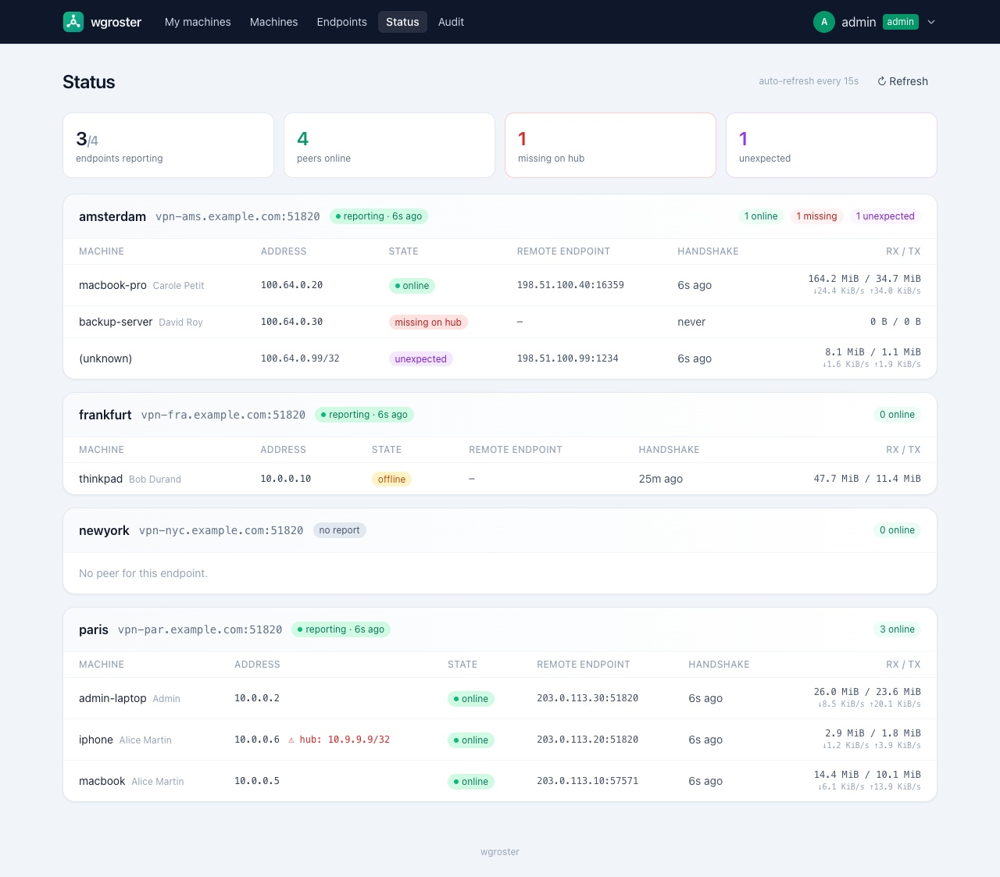
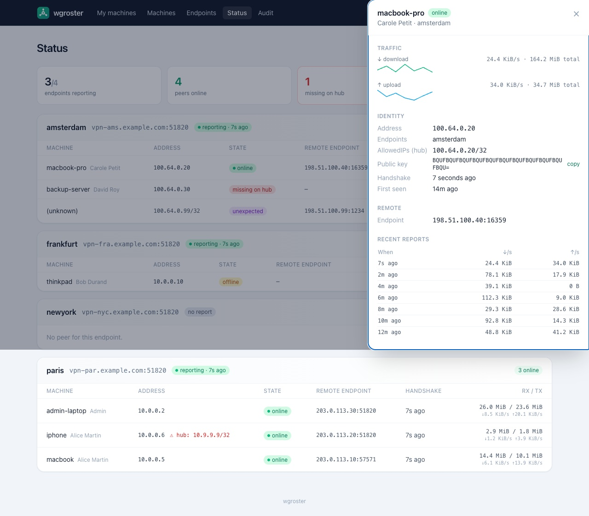
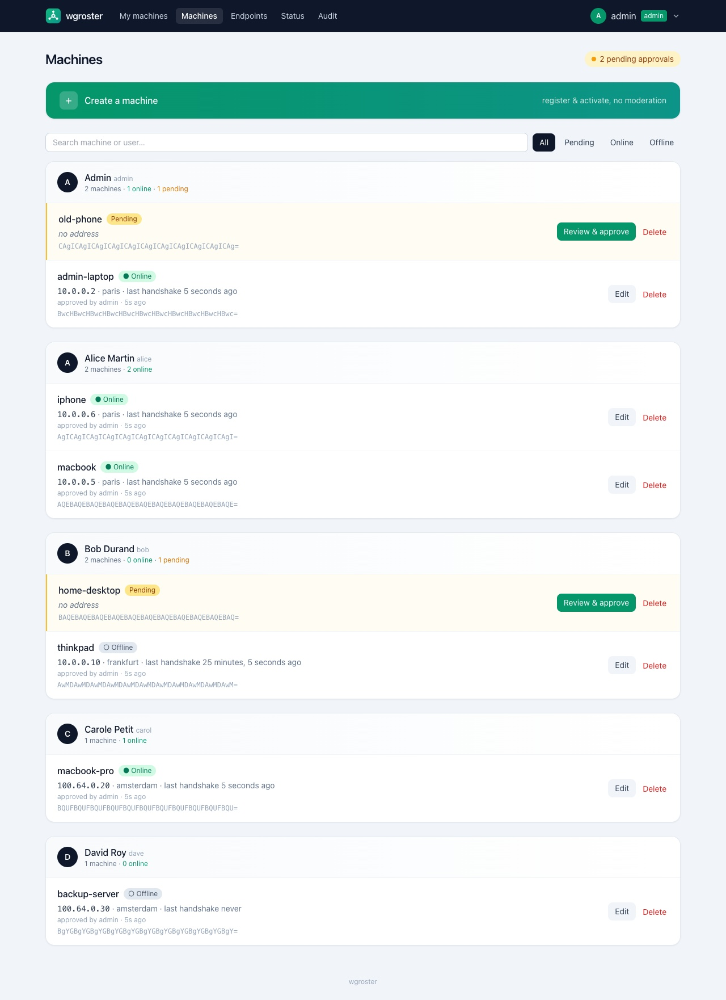
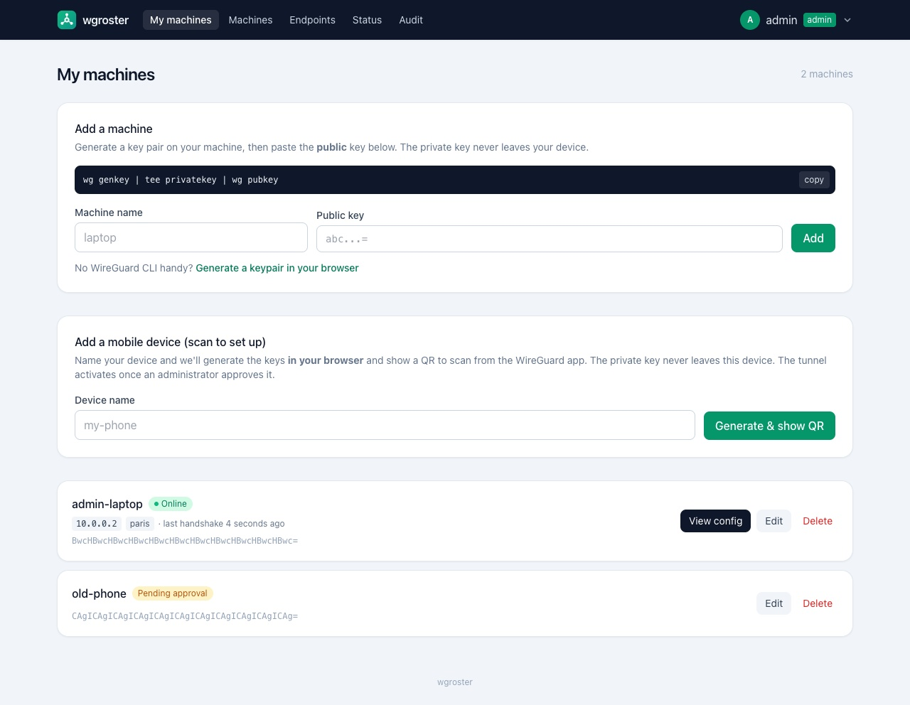
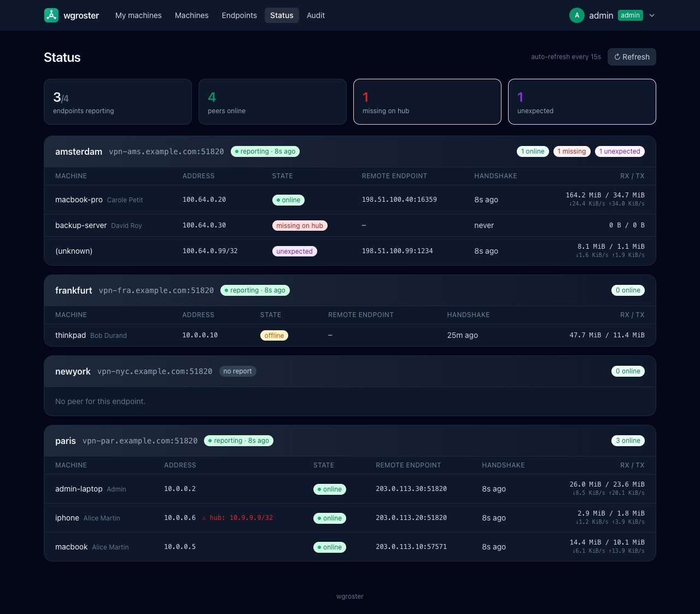

<p align="center">
  
</p>
<h1 align="center">wgroster</h1>
<p align="center"><em>Self-service WireGuard configs and live fleet status.</em></p>

<p align="center">
  
</p>

**wgroster** is a minimalist, self-hosted portal where users grab their own
WireGuard configuration and admins keep a live view of every concentrator and
peer across the fleet.

It is **tracking-only**: it is the source of truth for *who gets which config*
and shows *what each concentrator reports*, but it **never connects to or writes
to your WireGuard servers**. Provisioning peers on the servers stays in your
hands (manually, via Ansible, or via the bundled agent that runs **on** the
concentrator).

## Features

**Self-service (users)**
- Sign in with LDAP; register a machine by pasting its **public key** — the
  private key never reaches the server.
- Generate a key pair **in the browser** (no `wg` CLI needed), or paste an
  existing one.
- Download a ready-to-use `.conf`, or scan a **QR code** from the mobile app.
- Optional **scan-once self-enrollment** (`self_enroll`): name a device, the
  browser generates the keys and an IP is reserved on the spot, so a complete
  config/QR is shown immediately — it connects once an admin approves (guarded
  by `max_pending_per_user` and `pending_expiry_days`).

**Administration**
- Declare VPN **endpoints** (concentrators) with their public key, `host:port`,
  `AllowedIPs`, DNS, MTU and keepalive; each gets a rotatable **upload token**
  and a downloadable **concentrator `wg0.conf`** (interface + all peers).
- Approve pending machines, or **create & activate** a machine directly.
- IP addresses from a global pool with **next-free suggestion** and uniqueness
  validation; link a machine to **one or more endpoints** (multi-site).
- Edit everything (name, key, address, endpoints) from a clean modal.

**Source of truth & drift detection**
- Concentrators push `wg show dump`; wgroster compares it to the declared peers
  and flags **online / offline / missing-on-hub / not-linked-here / unexpected**
  and **AllowedIPs mismatch**.
- Resolve drift from the peer drawer in one step: **adopt** a peer whose key the
  portal has never seen (importing a config that predates wgroster), or **link /
  approve** a known machine the hub already carries.
- Exposes the **expected peer list** (`wg` / `tsv` / `json`) so external tooling
  (or the bundled agent) can reconcile the servers.

**Observability**
- Live **status dashboard** (auto-refresh) with per-peer **throughput**.
- Click a peer for a **detail drawer**: rx/tx **traffic curves** (14-day
  history), recent reports, identity/drift, and remote-IP info — reverse DNS
  plus optional **offline GeoIP** (MaxMind, looked up locally, no external call).
- **Prometheus** `/metrics`, optional **alert webhook**, and an **admin audit
  log**.

**Auth & accounts**
- OpenLDAP (admin via group membership, display name from `cn`, and avatar from
  `jpegPhoto` when present — shown in the navbar and on the admin machines list;
  names and photos of users who never logged in are resolved too, via the
  `search_bind_dn` service account or anonymously when the directory allows it).
- Optional **local admin** (bcrypt) to bootstrap or run without LDAP, with
  self-service password change.
- HMAC-signed session cookies, CSRF protection, login rate-limiting.

**UI & ops**
- **System / Light / Dark** theme.
- Single static Go binary, pure-Go SQLite (no CGO), Docker image.
- Front-end assets **self-hosted & embedded** (no CDN) → **strict CSP** (no
  inline JS/eval); content-hashed for cache-busting.
- Graceful shutdown, security headers (HSTS behind HTTPS), reverse-proxy aware.

## Screenshots

| Per-peer detail drawer (traffic, geo, drift) | Admin — machines grouped by user |
| :--: | :--: |
|  |  |
| **Self-service dashboard** | **Dark mode** |
|  |  |

<sub>More in [`docs/screenshots/`](docs/screenshots) (endpoints, audit log, login). Regenerate with `scripts/screenshots.sh`.</sub>

## Quickstart (2 minutes, no LDAP)

Prebuilt images are published to the GitHub Container Registry, so all you need
is Docker:

```sh
mkdir -p data
cat > config.yaml <<'EOF'
listen: ":8080"
session_key: "dev-only-change-me"
database: "/data/wgroster.db"
vpn_cidr: "10.0.0.0/16"
local_admin:
  username: "admin"
  password: "admin"      # dev only; use password_hash in production
EOF
docker run --rm -p 8080:8080 \
  -v "$PWD/config.yaml:/config/config.yaml:ro" \
  -v "$PWD/data:/data" \
  ghcr.io/wgroster/wgroster:latest
```

Prefer building from source? See [Binary](#binary) below.

Open <http://127.0.0.1:8080>, sign in as `admin` / `admin`, then:

1. **Endpoints** → create one (any public key / `host:port` works to explore).
2. **My machines** → add a machine; click **Generate a keypair in your browser**.
3. **Machines** (admin) → open the machine, assign an IP and the endpoint, save.
4. Back to **My machines** → **View config** to download the `.conf` or QR code.

No LDAP, no WireGuard install required to try the flow.

## How it works

Each machine has a **single** WireGuard interface (one `Address` from the global
`vpn_cidr` pool) and one `[Peer]` block per linked endpoint. Client IPs are
globally unique across all sites; each endpoint declares the networks reachable
behind it via its `AllowedIPs`.

```
internal/
  config/  YAML configuration            geoip/  optional offline MaxMind lookup
  store/   SQLite persistence (pure Go)   ldap/   OpenLDAP bind + admin group
  auth/    signed session cookies + CSRF  ipam/   global client address pool
  wg/      config gen + "wg show" parse   web/    handlers, templates, embedded assets
```

## Configuration

Copy `config.example.yaml` to `config.yaml` and adjust it. Key fields:

- `vpn_cidr` — global client address pool (e.g. `10.0.0.0/16`).
- `ldap.*` — OpenLDAP URL, bind DN pattern, admin group, name attribute, photo
  attribute (`photo_attr`, default `jpegPhoto`), optional service account.
- `session_key` — secret for signing cookies (`openssl rand -hex 32`), or the
  `WG_SESSION_KEY` environment variable.
- `local_admin` (optional) — built-in admin, checked before LDAP. LDAP becomes
  optional when it is set.
- `audit_retention_days` — prune admin audit entries older than N days
  (0 = keep forever).
- `metrics_token`, `alert_webhook_url`, `geoip_db` / `geoip_asn_db`,
  `cookie_secure`, `trusted_proxy` — see the sections below.

Generate a bcrypt hash for the local admin password:

```sh
echo -n 's3cret' | ./wgroster -hash-password   # -> $2a$10$...  (local_admin.password_hash)
```

## Running

### Docker

```sh
cp config.example.yaml config.yaml   # then edit it
docker compose up -d
```

Compose pulls `ghcr.io/wgroster/wgroster:latest`; the database lives in `./data`
and the config is mounted read-only. To build the image locally instead,
uncomment `build: .` in `docker-compose.yml` and run `docker compose up -d
--build`. Set `TZ` (e.g. `environment: { TZ: Europe/Paris }`) for local times in
the UI/audit log.

Image tags: `latest` (default branch), `vX.Y.Z` / `vX.Y` (releases), and the
commit SHA. Pin a release tag in production.

### Binary

```sh
go build -o wgroster ./cmd/wgroster
./wgroster -config config.yaml
```

## Concentrators

Each concentrator pushes its status regularly. The **agent kit** automates this
and runs entirely **on the concentrator** — wgroster never connects to it.

```sh
install -m755 scripts/wgroster-agent.sh /usr/local/bin/wgroster-agent.sh
cp scripts/wgroster-agent.{service,timer} /etc/systemd/system/
# edit WG_PORTAL_URL / WG_ENDPOINT_ID / WG_TOKEN / WG_RECONCILE in the .service
systemctl daemon-reload
systemctl enable --now wgroster-agent.timer
```

- `WG_RECONCILE=0` (default) → **monitoring only** (push `wg show dump`).
- `WG_RECONCILE=1` → also **reconcile**: pull the expected peers and apply them
  locally with `wg set` (add/update/remove) so the hub matches wgroster.

**Prefer the systemd timer over cron.** A failed `oneshot` run is recorded in
the journal (`journalctl -u wgroster-agent`) and shows up in
`systemctl --failed` — it never emails you. The agent also retries transient
network blips (`curl --retry`), so a brief outage doesn't even count as a
failure. If you must use cron instead, remember cron mails on *any* output: set
`MAILTO=""` in the crontab, or route diagnostics to the journal
(`… 2>&1 | logger -t wgroster-agent`) rather than blindly discarding them with
`>/dev/null`. You don't need local mail to catch a silent concentrator anyway —
wgroster alerts on it centrally via `wg_last_report_age_seconds` (see
[Monitoring & alerting](#monitoring--alerting)).

Or do it by hand (the ready-made commands and token are on the **Endpoints**
admin page):

```sh
wg show all dump | curl -s -H "Authorization: Bearer <TOKEN>" \
  --data-binary @- https://wgroster.example.com/api/endpoints/<ID>/status

curl -s -H "Authorization: Bearer <TOKEN>" \
  "https://wgroster.example.com/api/endpoints/<ID>/expected-peers?format=wg"
```

**Bootstrapping a new concentrator.** Every endpoint exposes a complete
`wg0.conf` for the hub itself: an `[Interface]` section (tunnel address, listen
port, MTU — with a `PrivateKey` placeholder you fill in, since wgroster never
sees private keys) followed by one `[Peer]` per assigned machine. Unlike
`expected-peers` (which returns only the peer list for ongoing reconciliation),
this is the full file for first-time setup. It is available three ways:

- **Concentrator setup** panel on the **Endpoints** admin page — shown inline,
  copyable, and downloadable.
- Pulled with the endpoint's upload token (no portal login), e.g. on first boot:

```sh
curl -s -H "Authorization: Bearer <TOKEN>" \
  "https://wgroster.example.com/api/endpoints/<ID>/config" > /etc/wireguard/wg0.conf
```

Then fill in the private key and `wg-quick up wg0`.

## Monitoring & alerting

The **Status** page shows per-peer throughput and drift. Click a peer for the
detail drawer (traffic curves, recent reports, reverse DNS, and — if you provide
local **MaxMind GeoLite2** databases via `geoip_db` (Country *or* City) and
optionally `geoip_asn_db` — country/city/ASN, resolved offline).

`/metrics` exposes a Prometheus model (never anonymous — needs `metrics_token`
or an admin session):

- `wg_endpoints_total`, `wg_endpoints_reporting`, `wg_machines_total`,
  `wg_machines_pending`
- `wg_peers_online|offline|missing|unlinked|unexpected{endpoint="…"}` —
  `unlinked` counts reported peers the portal knows but has not activated on that
  endpoint, `unexpected` those with a public key it has never seen.
- `wg_last_report_age_seconds{endpoint="…"}` — alert when a concentrator goes
  quiet.

```yaml
scrape_configs:
  - job_name: wgroster
    metrics_path: /metrics
    scheme: https
    authorization: { credentials: "<METRICS_TOKEN>" }
    static_configs: [{ targets: ["wgroster.example.com:443"] }]
```

An optional **alert webhook** (`alert_webhook_url`) is POSTed on transitions:

```json
{"endpoint":"paris","type":"missing","status":"firing","detail":"2 peer(s) missing on hub","time":"2026-06-04T08:00:00Z"}
```

`type`: `stale | missing | unlinked | unexpected | mismatch`; `status`:
`firing | resolved`.
Every admin action is recorded on the **Audit** page (`/admin/audit`).

## Security & production checklist

- [ ] Serve over HTTPS at a reverse proxy and set `cookie_secure: true`
      (enables HSTS).
- [ ] Set a stable `session_key` (or `WG_SESSION_KEY`).
- [ ] Use `local_admin.password_hash` (bcrypt), never `password` — or LDAP only.
- [ ] `trusted_proxy: true` **only** behind a proxy that overwrites
      `X-Forwarded-For` (correct client IPs and login rate-limiting).
- [ ] Set `metrics_token` for Prometheus.
- [ ] Back up the SQLite database.

Reverse proxy examples — Caddy:

```
wgroster.example.com {
    reverse_proxy 127.0.0.1:8080
}
```

nginx:

```nginx
location / {
    proxy_pass         http://127.0.0.1:8080;
    proxy_set_header   Host              $host;
    proxy_set_header   X-Forwarded-For   $proxy_add_x_forwarded_for;
    proxy_set_header   X-Forwarded-Proto $scheme;
}
```

## Backups

All state is the single SQLite file (`database:`):

```sh
sqlite3 /data/wgroster.db ".backup '/backup/wgroster-$(date +%F).db'"
```

## Development

The Tailwind CSS is prebuilt at `internal/web/static/app.css` (dark mode = the
`class` strategy). Regenerate it after changing template classes with the
standalone Tailwind CLI:

```sh
tailwindcss -i tailwind.input.css -o internal/web/static/app.css --minify
```

Run the checks: `gofmt -l . && go vet ./... && go test ./...`.

Regenerate the README screenshots (seeds a fake DB, runs the server, drives a
headless Chrome — requires Google Chrome / Chromium):

```sh
./scripts/screenshots.sh        # writes docs/screenshots/*.png
```

`tools/seed` builds the demo database and `tools/screenshots` (a separate Go
module, so chromedp never reaches the main one) captures the pages.

## License

Licensed under the [Apache License 2.0](LICENSE).

---

<p align="center">
  <sub>Sponsored by</sub><br>
  <a href="https://bleemeo.com"></a>
</p>

